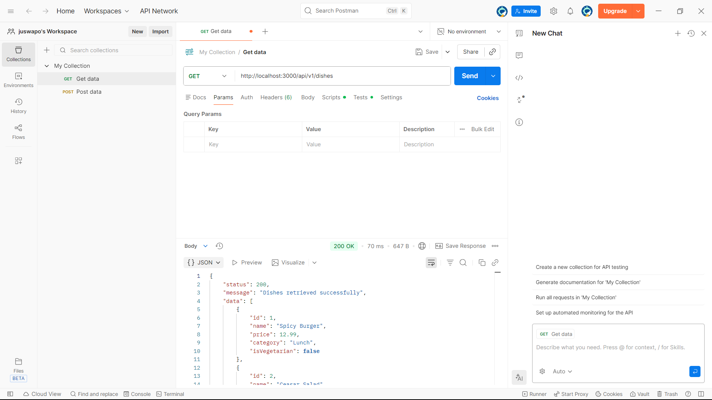

# RESTful API Activity – Aaron Joshua Abalos

## Best Practices Implementation

### 1. Environment Variables
**Why did we put `BASE_URI` in `.env` instead of hardcoding it?**  
Answer: To keep config secure and flexible across environments.

### 2. Resource Modeling
**Why did we use plural nouns (e.g., `/dishes`) for our routes?**  
Answer: Because it follows REST conventions and clearly represents collections.

### 3. Status Codes
**When do we use `201 Created` vs `200 OK`?**  
Answer: `201` when a new resource is successfully added, `200` when a resource is retrieved, updated, or deleted.

**Why is it important to return `404` instead of just an empty array or a generic error?**  
Answer: It communicates that the resource doesn’t exist and avoids confusion with empty results.

### 4. Testing

Successful GET request to `/api/v1/dishes`:

