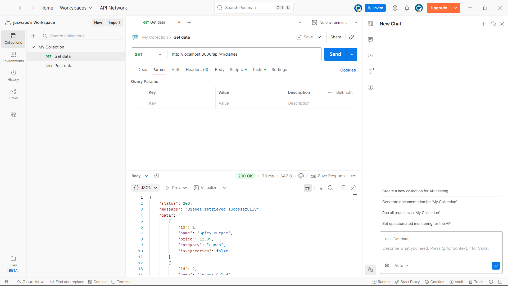

# RESTful API Activity – Aaron Joshua Abalos

## Best Practices Implementation

### 1. Environment Variables
**Why did we put `BASE_URI` in `.env` instead of hardcoding it?**  
Answer: To keep config secure and flexible across environments.

### 2. Resource Modeling
**Why did we use plural nouns (e.g., `/dishes`) for our routes?**  
Answer: Because it follows REST conventions and clearly represents collections.

### 3. Status Codes
**When do we use `201 Created` vs `200 OK`?**  
Answer: `201` when a new resource is successfully added, `200` when a resource is retrieved, updated, or deleted.

**Why is it important to return `404` instead of just an empty array or a generic error?**  
Answer: It communicates that the resource doesn’t exist and avoids confusion with empty results.

### 4. Testing

Successful GET request to `/api/v1/dishes`:

**Why did I choose to Embed the [Review/Tag/Log]?**
Answer: When you fetch a transaction, you immediately get its reviews/tags without needing a second query.

**Why did I choose to Reference the [Chef/User/Guest]?**
Answer: If a user updates their email, you only change it in the User collection.

# API Security Concepts

## 1. Authentication vs Authorization
- **Authentication**: Verifies *who* the user is. In our code, this happens during login when the system checks the email and password, then issues a JWT if valid.  
- **Authorization**: Verifies *what* the authenticated user can do. In our code, the JWT includes the user’s role, and middleware checks this role before granting access to certain routes.

---

## 2. Security (bcrypt)
We use **bcryptjs** to hash passwords before saving them in MongoDB.  
- Plain text passwords are insecure if the database is compromised.  
- Bcrypt adds a salt and multiple hashing rounds, making it computationally expensive to reverse.  
- This ensures stolen hashes cannot easily be converted back into real passwords.

---

## 3. JWT Structure
it checks the token’s validity, identifies the user, and ensures only authenticated requests can access protected routes.

